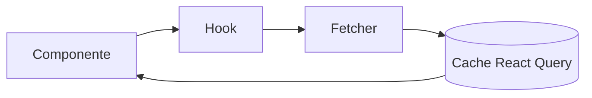

# React — Repo Escuela (TypeScript + Vite)

Repositorio-escuela para aprender React con TypeScript de forma práctica, modular y en español. Incluye ejercicios, soluciones, tests y documentación.

## Índice rápido
- Ruta de aprendizaje (0 → 1 → 2 → 3 → 4)
- Cómo empezar (3 comandos)
- Estructura del repo
- Scripts disponibles
- Enlaces útiles (CI, deploy, Storybook)

## Cómo empezar (3 comandos)
1. pnpm install
2. pnpm dev
3. pnpm test

Requiere Node 20 y pnpm.

## Ruta de aprendizaje
- Semana 0: entorno, scripts `dev/test/lint/build`, convenciones.
- Semana 1: componentes, estado, efectos → reto 🟢 “TodoList con filtro”.
- Semana 2: router + forms + zod → reto 🟡 “Wizard de registro con validación”.
- Semana 3: react-query + estado global → reto 🟡 “Dashboard con cache + refetch”.
- Semana 4: performance + a11y + Storybook → reto 🔴 “Design system mini”.

## Estructura
Consulta `docs/` para teoría y `apps/` para práctica. La app por defecto es `apps/00-basics`.

## Badges
- Build: GitHub Actions
- Tests: GitHub Actions
- Coverage: Vitest (report básico)

## Deploy
- GitHub Pages: se publica automáticamente la app `00-basics` en la rama `gh-pages`.

## Diagrama (Mermaid)

